# 📚 ClassTrack

**ClassTrack** is a complete classroom management app built with Flutter. It helps teachers efficiently manage class attendance, student information, CT marks, remarks, and CRs (Class Representatives). Designed with a modern UI, it stores everything locally using SQLite and manages state efficiently with **Provider**.

---

## 🚀 Features

- 👨‍🏫 Add, update & delete student information
- 📅 Take and store attendance for any date
- 🔁 View and modify attendance records by date
- 📝 Add remarks for individual students
- 📊 Store CT (Class Test) marks for each student (up to 4 CTs)
- 🎯 Assign and update Class Representatives (CRs)
- 🔔 Real-time UI feedback with styled snackbar notifications
- 🎨 Beautiful and responsive design with custom colors/fonts
- 🗂️ Local database using **Sqflite**
- 🧠 **State Management using Provider**  
  → Used to handle class and student data across widgets efficiently

---

## 📸 Screenshots

### 🏫 Class Management

<table>
  <tr>
    <td align="center">
      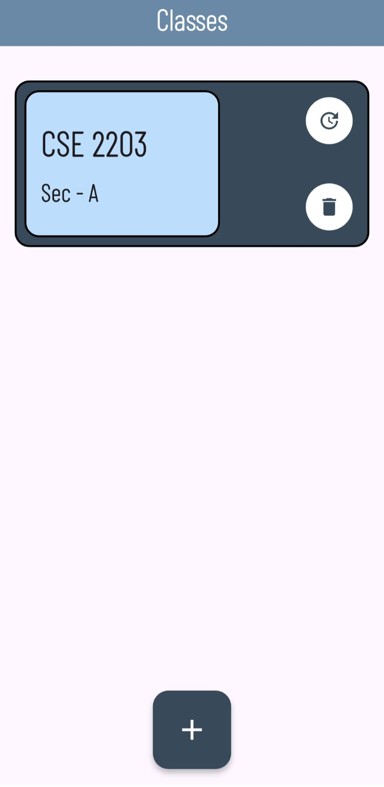<br>
      <b>🏫 Class Screen</b>
    </td>
    <td align="center">
      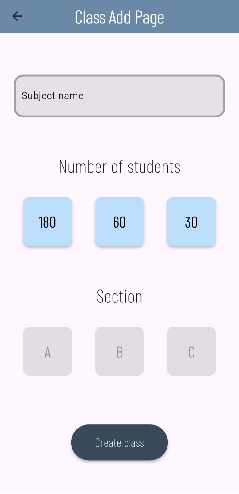<br>
      <b>➕ Add Class</b>
    </td>
    <td align="center">
      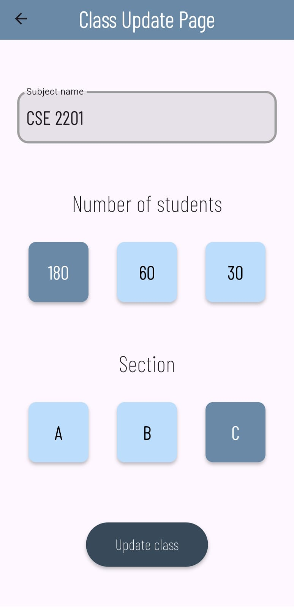<br>
      <b>✏️ Update Class</b>
    </td>
    <td align="center">
      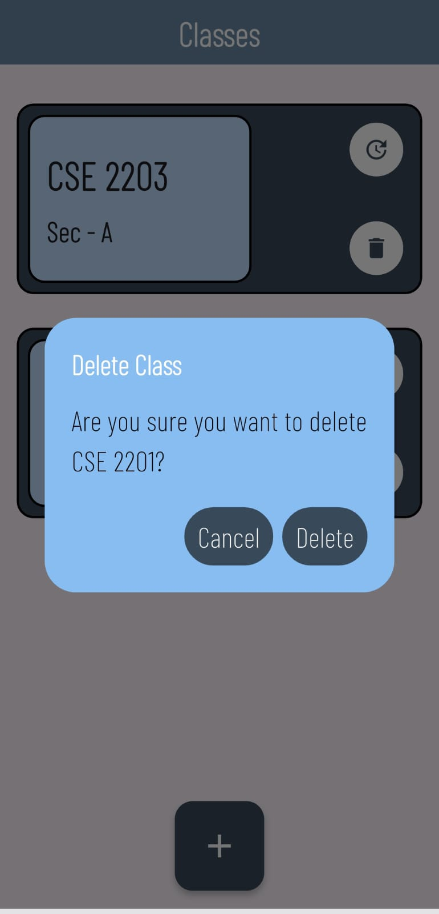<br>
      <b>🗑️ Delete Class</b>
    </td>
  </tr>
</table>

---

### 🔽 Selection Page

<table>
  <tr>
    <td align="center">
      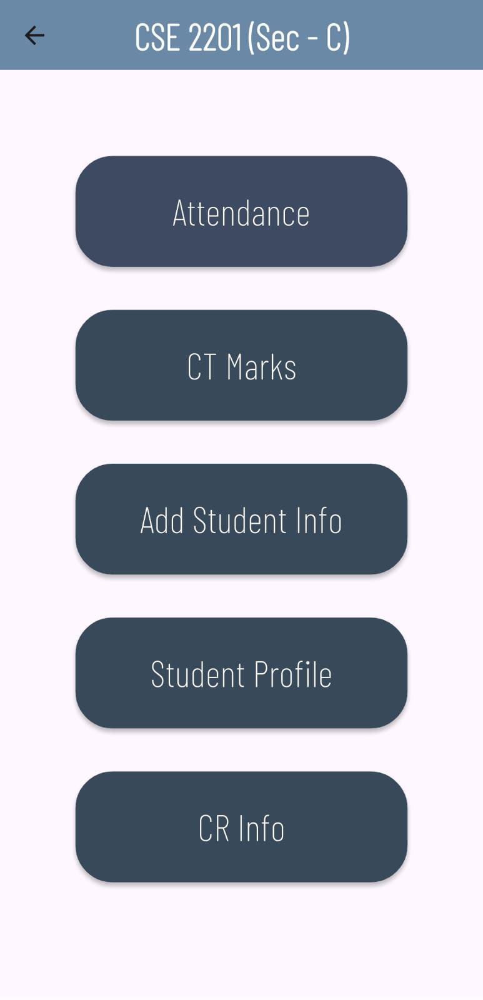<br>
      <b>🔽 Selection Page</b>
    </td>
  </tr>
</table>

---

### 📆 Attendance Management

<table>
  <tr>
    <td align="center">
      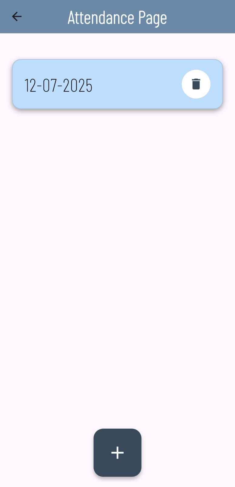<br>
      <b>📆 Attendance</b>
    </td>
    <td align="center">
      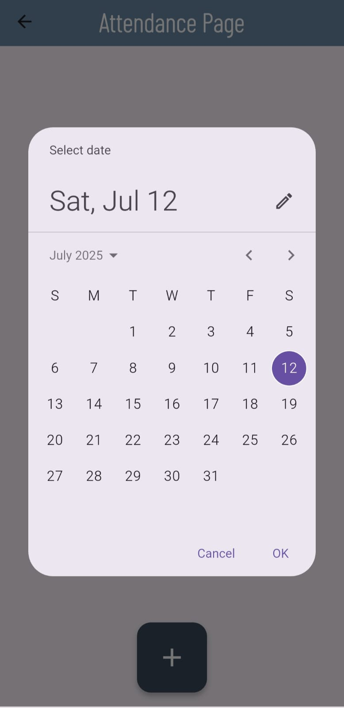<br>
      <b>➕ Add Attendance</b>
    </td>
    <td align="center">
      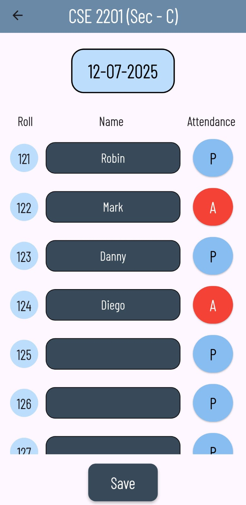<br>
      <b>✔️ Mark Attendance</b>
    </td>
    <td align="center">
      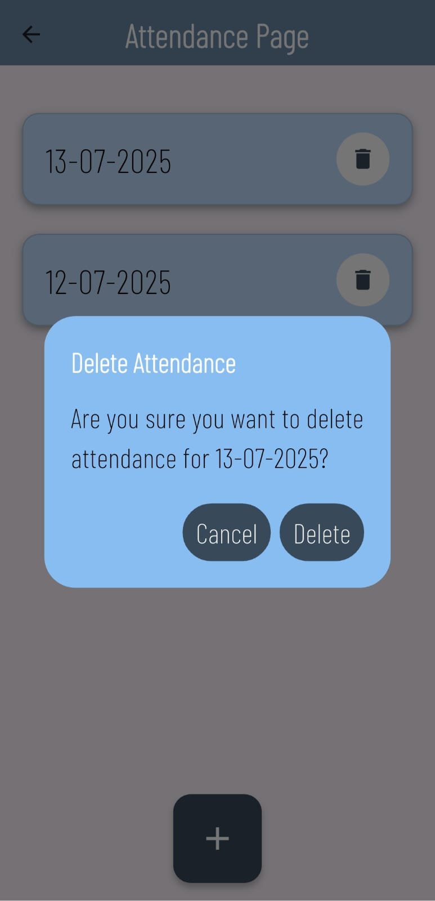<br>
      <b>🗑️ Delete Attendance</b>
    </td>
  </tr>
</table>

---

### 🧮 CT Marks

<table>
  <tr>
    <td align="center">
      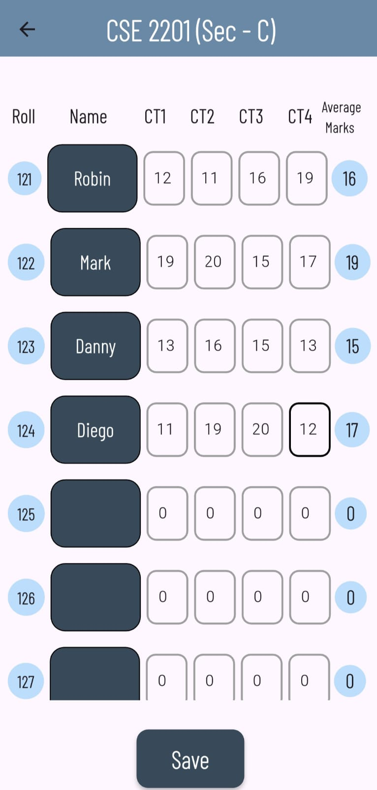<br>
      <b>🧮 Add CT Marks</b>
    </td>
  </tr>
</table>

---

### 👨‍🎓 Student Info

<table>
  <tr>
    <td align="center">
      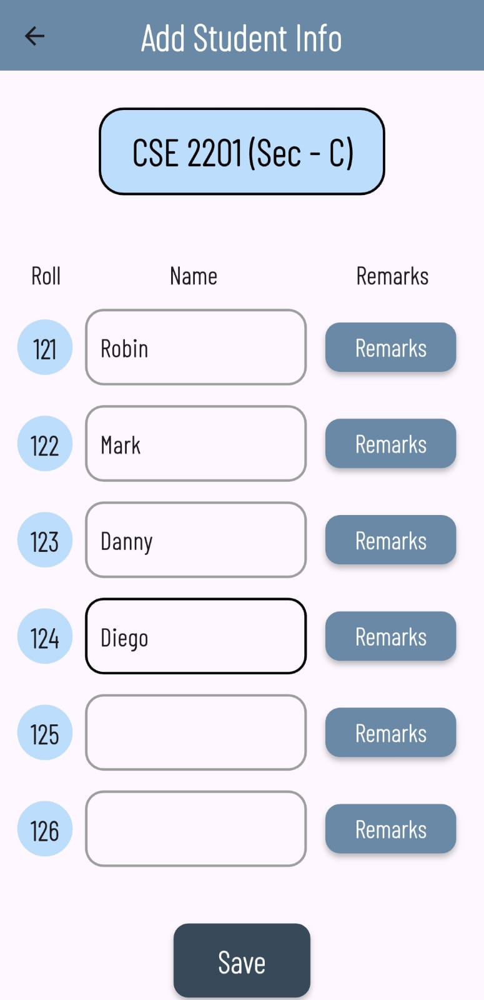<br>
      <b>➕ Add Student Info</b>
    </td>
    <td align="center">
      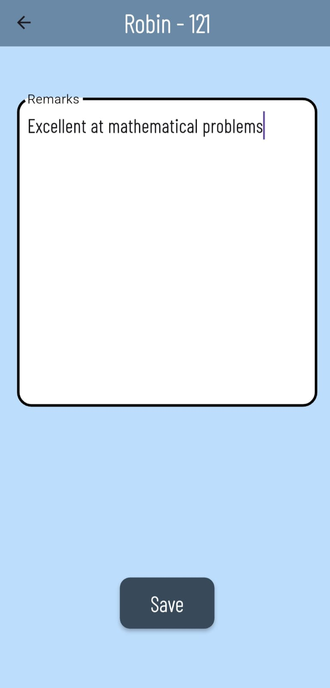<br>
      <b>💬 Add Remarks</b>
    </td>
  </tr>
</table>

---

### 👤 Student Profile

<table>
  <tr>
    <td align="center">
      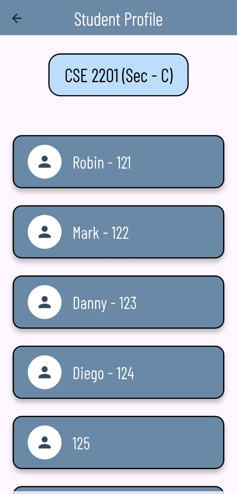<br>
      <b>📄 Student Profile Page</b>
    </td>
    <td align="center">
      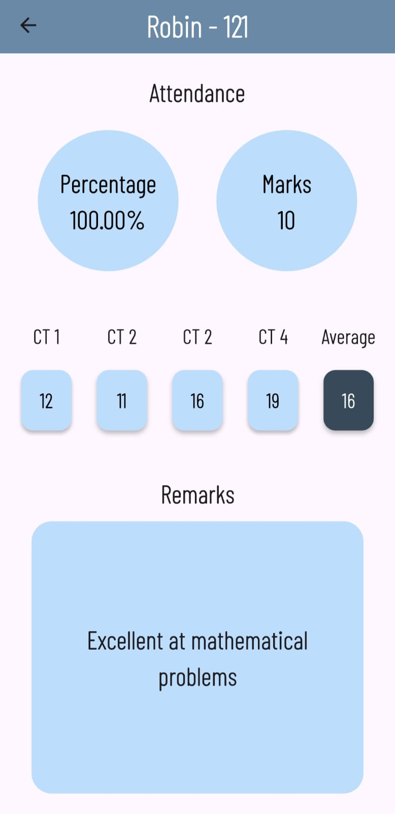<br>
      <b>👤 Student Profile</b>
    </td>
  </tr>
</table>

---

### 👥 CR (Class Representative) Management

<table>
  <tr>
    <td align="center">
      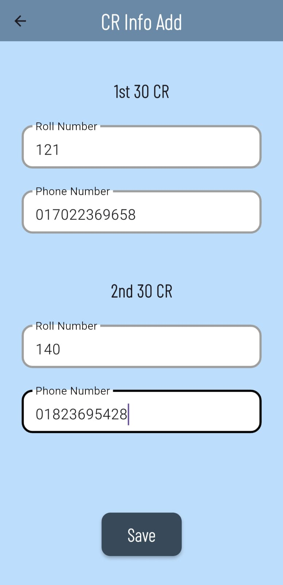<br>
      <b>➕ Add CR</b>
    </td>
    <td align="center">
      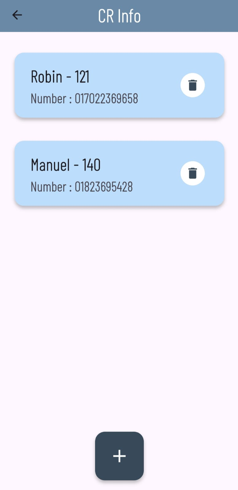<br>
      <b>📋 CR List</b>
    </td>
    <td align="center">
      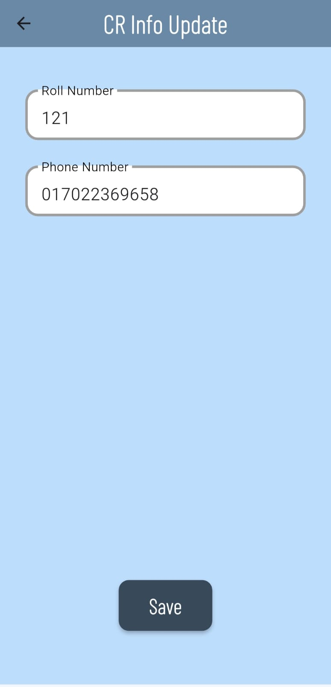<br>
      <b>✏️ Update CR</b>
    </td>
    <td align="center">
      <br>
      <b>🗑️ Delete CR</b>
    </td>
  </tr>
</table>

---

## 🛠️ Tech Stack

- **Flutter** – Cross-platform UI toolkit
- **Provider** – State management
- **Sqflite** – Local database
- **Custom Widgets** – Modular & reusable component design
- **Material Design** – For beautiful UI experience

---

## 📦 Dependencies

```yaml
dependencies:
  flutter:
  provider: ^6.0.0
  sqflite: ^2.2.0+3
  path_provider: ^2.0.11
